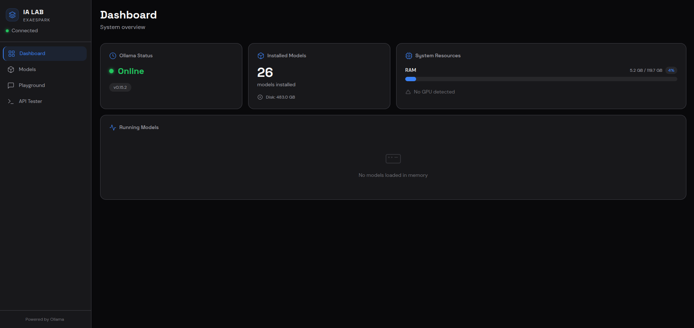
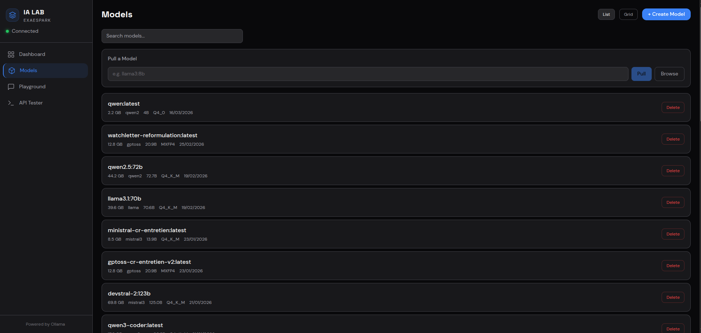
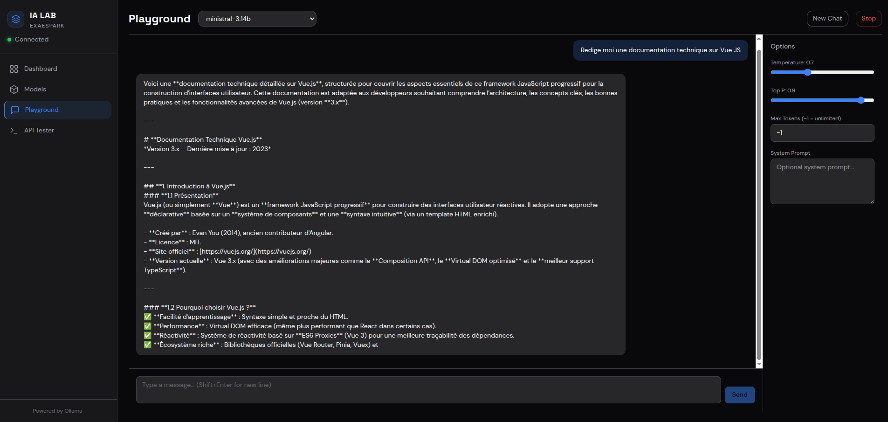
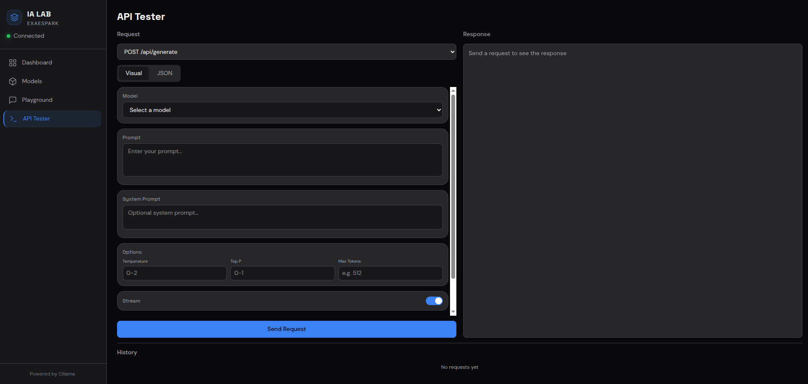

<p align="center">
  <h1 align="center">Ollama Dashboard</h1>
  <p align="center">
    A modern, sleek web dashboard to manage and interact with your <a href="https://ollama.com">Ollama</a> models.<br/>
    Built with Nuxt 4, Vue 3, Tailwind CSS & Pinia.
  </p>
</p>

<p align="center">
  <a href="LICENSE"></a>
  
  
  
  
</p>

---

## Screenshots

### Dashboard — System Overview

Monitor your Ollama instance at a glance: connection status, version, number of installed models, RAM/GPU usage, and currently running models.



### Models — Browse & Manage

Search, pull, create, and delete models. View detailed metadata (size, family, quantization, modification date) in list or grid view.



### Playground — Chat with your Models

A conversational interface to interact with any installed model. Supports streaming responses, conversation history, and multiple chat sessions.



### API Tester — Explore the Ollama API

A built-in visual request builder for every Ollama API endpoint. Switch between visual and raw JSON modes, configure parameters (temperature, top_p, max tokens, system prompt), toggle streaming, and review your request history.



---

## Features

- **Real-time Dashboard** — Connection status, Ollama version, installed model count, RAM & GPU monitoring, running models list
- **Model Management** — Search, pull, delete, and create custom models with full metadata display (size, family, quantization)
- **Chat Playground** — Conversational UI with streaming support, chat history, and multi-session management
- **API Tester** — Visual & JSON request builder for all Ollama API endpoints, with parameter tuning and request history
- **Dark Theme** — Sleek dark UI designed for extended use
- **Docker Ready** — One-command deployment with Docker Compose
- **Remote Ollama Support** — Connect to Ollama running on any host, not just localhost

---

## Quick Start

### Prerequisites

- [Node.js](https://nodejs.org/) >= 18
- [Ollama](https://ollama.com) running locally or on a remote host

### npm

```bash
git clone https://github.com/jemagne/Dashboard-Ollama.git
cd Dashboard-Ollama
npm install
npm run dev
```

Open [http://localhost:3000](http://localhost:3000).

### Docker

```bash
docker compose up -d
```

Or for development with hot-reload:

```bash
docker compose -f docker-compose.dev.yml up
```

---

## Configuration

Set the Ollama host via environment variable:

```env
# Default: http://localhost:11434
NUXT_OLLAMA_HOST=http://your-ollama-host:11434
```

With Docker Compose, edit the `environment` section in `docker-compose.yml`.

---

## Tech Stack

| Layer | Technology |
|-------|-----------|
| Framework | [Nuxt 4](https://nuxt.com) |
| UI | [Vue 3](https://vuejs.org) + [Tailwind CSS 4](https://tailwindcss.com) |
| State | [Pinia](https://pinia.vuejs.org) |
| Animations | [nuxt-anime](https://github.com/imsyy/nuxt-anime) |
| Runtime | [Node.js 22](https://nodejs.org) |
| Container | [Docker](https://docker.com) (multi-stage build) |

---

## Build for Production

```bash
npm run build
npm run preview
```

---

## Contributing

Contributions are welcome! Feel free to open an issue or submit a pull request.

---

## License

[MIT](LICENSE) — Made by [jemagne](https://github.com/jemagne)
